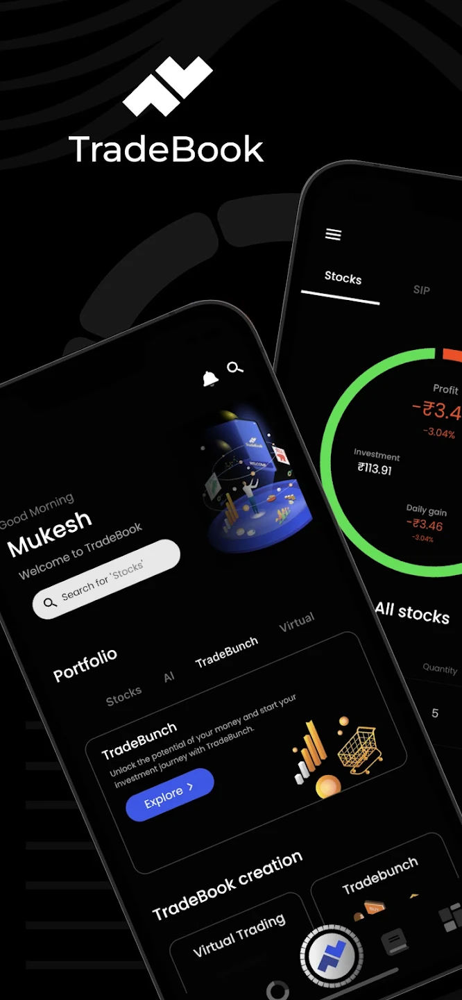
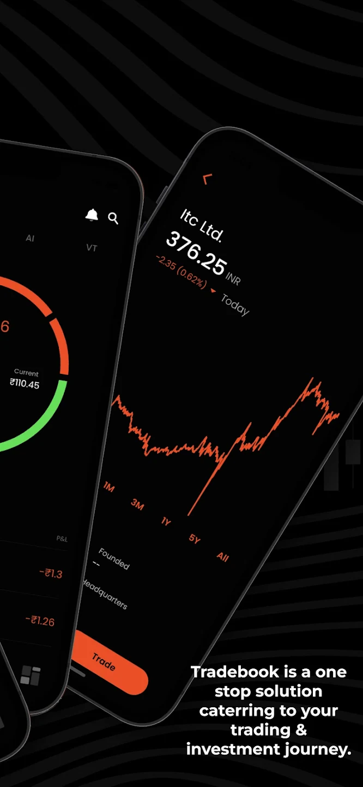
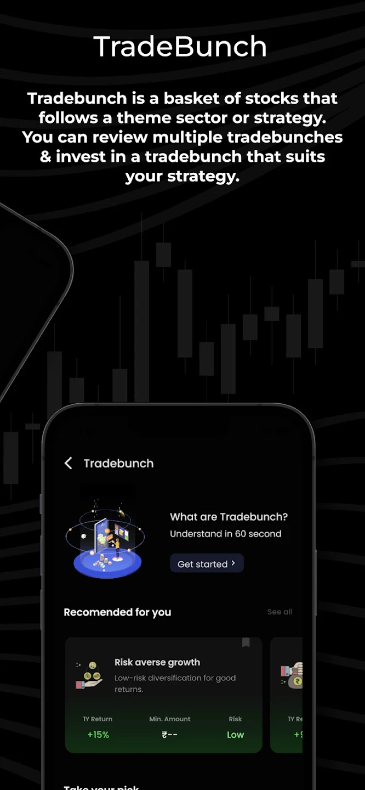
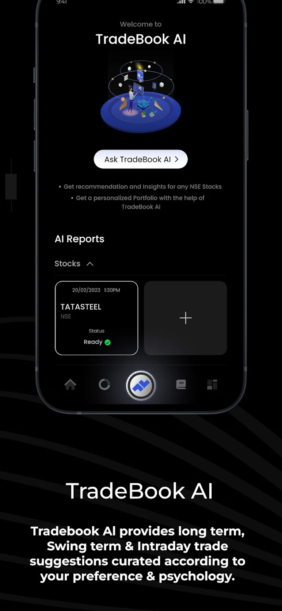
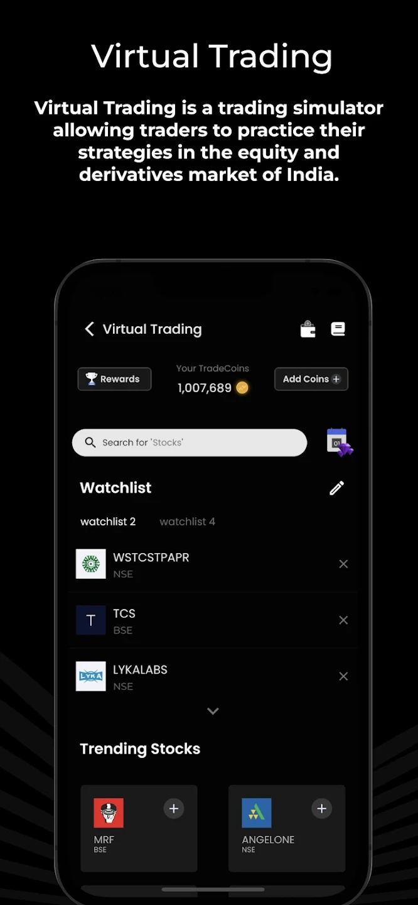
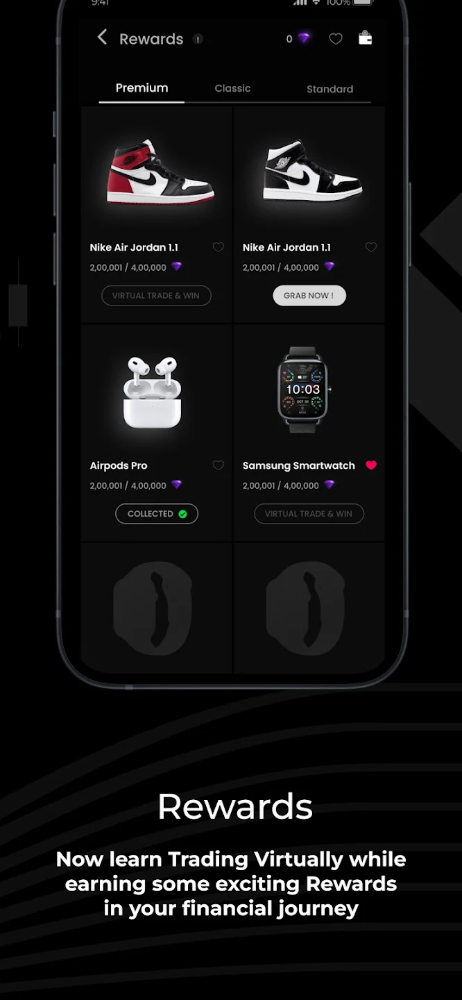
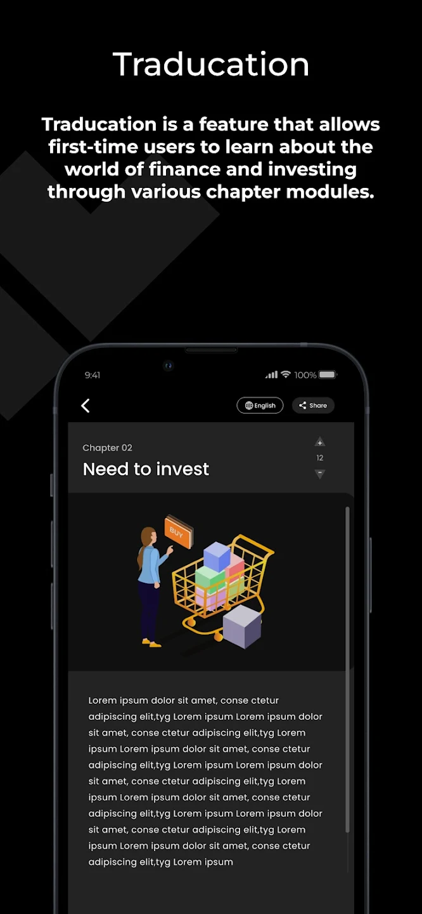
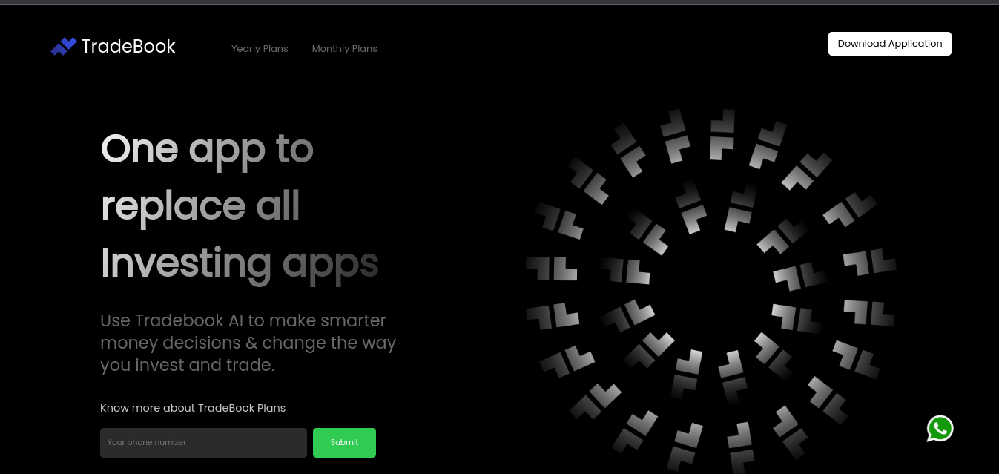

# Hi there! 👋 Mukesh here
I am a Full Stack Developer from India.

## About Me

- I'm working as a Full Stack Developer and handling both backend and frontend stacks.
- I have experience with web applications, Flutter applications, Android applications, and AI tools as well..
- Throughout my experience, I have worked with a variety of tech stacks, covering a wide range of development areas including web, Android, iOS development, cloud technologies like AWS, and ML & AI..
- How to reach me: [Linkedin](https://in.linkedin.com/in/mukesh-rajpurohit-39147016b).

## Languages and Tools :

&nbsp
&nbsp;
  &nbsp;
&nbsp;
&nbsp;
&nbsp;
&nbsp;
&nbsp;
&nbsp;
&nbsp;
&nbsp;
&nbsp;
&nbsp;
&nbsp;
&nbsp;
&nbsp;

## Projects

### TradeBook Application

&nbsp;
&nbsp;
&nbsp;
&nbsp;
&nbsp;
&nbsp;
&nbsp;

TradeBook is a Fintech application that is live on the Play Store and the App Store. It utilizes a microservices architecture with technologies including Flutter, Node.js, Python, Docker, AWS EC2, and S3 bucket. It took 2.5 months to complete this application system, resulting in an amazing user experience with amazing features too.

Live Demo: [Play store](https://play.google.com/store/apps/details?id=com.we3.tradebook.app), [App Store](https://apps.apple.com/in/app/tradebook-one-stop-solution/id1659276893)

### TradeBook Website

TradeBook website is landing page for marketing purpose added features like payment gatway for plan purchase, support/contact features, download application redirect based on device type.

Live Demo: [TradeBook](https://play.google.com/store/apps/details?id=com.we3.tradebook.app)

## Contact

You can reach me at your.email@example.com.

## Connect with Me

- [GitHub](https://github.com/yourusername)
- [LinkedIn](https://www.linkedin.com/in/yourusername)
- [Twitter](https://twitter.com/yourusername)

Feel free to explore my projects and get in touch!
